<div align="center">
  &nbsp; &nbsp; &nbsp; &nbsp; &nbsp; &nbsp; &nbsp; &nbsp;
  <h1>Nergal</h1>
  <p><strong>Keyboard-first Linux desktop HUD for AI coding-agent CLIs.</strong><br />
  The agent stays in a real terminal at the center; plan, task, git, and activity panels light up live from the hook stream.</p>
</div>

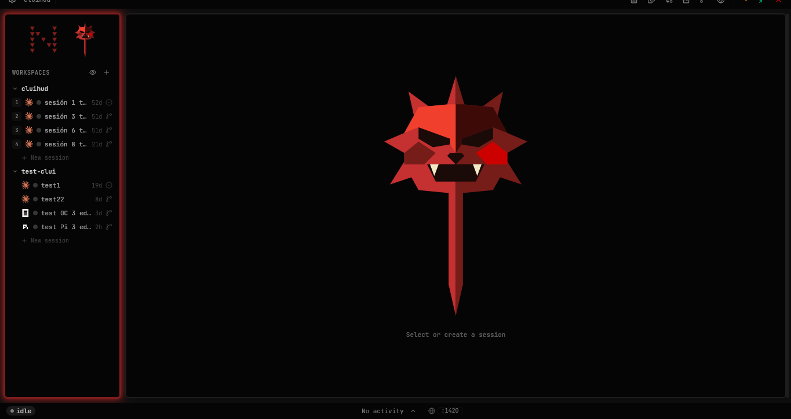

---

## What is Nergal?

Nergal is a thin, opinionated wrapper around an AI coding-agent CLI. It does not replace the terminal, the agent, or the editor — it spawns the agent binary inside a PTY and listens to the hook pipeline. Hook events flow into Jotai atoms, transcript JSONL files are tailed with inotify, and `PermissionRequest` / `AskUserQuestion` calls block on FIFOs that the GUI writes back to. The terminal itself is canvas-rendered with `wezterm-term` server-side; there is no `xterm.js` anywhere.

The result is a keyboard-first HUD where the agent stays in the centerpiece terminal and everything around it (plan editing, task tracking, git ops, conflict resolution, live preview) reacts in real time without breaking the agent's flow.

## Features

### Agent integration

- **Multi-session PTY terminal** — Real `claude` (or other registered CLI agent) running in a PTY. Multiple sessions across multiple workspaces, each with its own state indicator (idle / thinking / working / attention / completed).
- **Plan review with inline annotations** — Blocks `ExitPlanMode`. Surfaces the plan in an annotatable view; approve, or reject with structured feedback that points the agent back to the edited plan file.
- **Live task tracking** — `TodoWrite` events stream into a session-scoped task panel. State and progress visible without scrolling the transcript.
- **Multi-agent support** — Adapter foundation for Claude Code, Codex, OpenCode, and Pi. Each adapter declares its capabilities; the UI gates panels accordingly.

### Git workflow

- **Git panel** — Files / History / Stashes / PRs / Conflicts as chip tabs. Stage, commit, pull, push, stash, browse history, review PRs from one surface.
- **Atomic ship-flow** — A single action composes commit (if needed) + push + open PR. Editable preview dialog with title, body, commit list, and base..HEAD diff stat.
- **Three-pane conflict resolution** — Side-by-side ours / theirs / merged editor with one-click "Accept ours / theirs / Ask agent to resolve".
- **Side-by-side diff viewer** — Keyboard-navigable hunks (`j` / `k`), used for file diffs, commit diffs, and PR review.

### Code & docs

- **File panel with quick editing** — Project tree plus a CodeMirror 6 editor with syntax for TS / JS / JSON / MD / Rust / CSS / HTML. Single-click preview, double-click to pin.
- **OpenSpec viewer** — Read-only viewer of `openspec/` artifacts (proposals, designs, specs, tasks) with the same annotation engine used for plans.
- **Live preview browser** — Embedded iframe panel plus a localhost port scanner. Listening dev servers appear as status-bar chips → click opens the URL.

### Session UX

- **Floating scratchpad** — Multi-tab notes anchored to a configurable directory. Semi-transparent floating panel that survives across sessions, with content-hash own-write tracking so the watcher does not echo.
- **Activity timeline + DAG graph** — Timeline strip, event list (thinking blocks expandable inline), and an interactive DAG of tool calls for the active session.
- **Theme system** — 13 built-in themes (v1-dark, gothic, dracula, monokai, tokyo-night, …) plus a custom theme editor with live preview.

## Screenshots

<table>
  <tr>
    <td>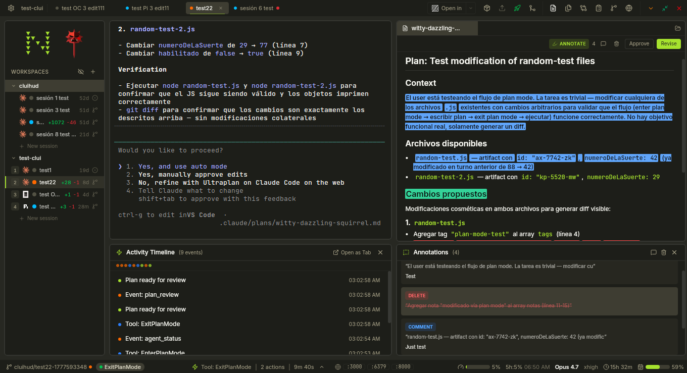<br /><sub>Plan review with inline annotations</sub></td>
    <td>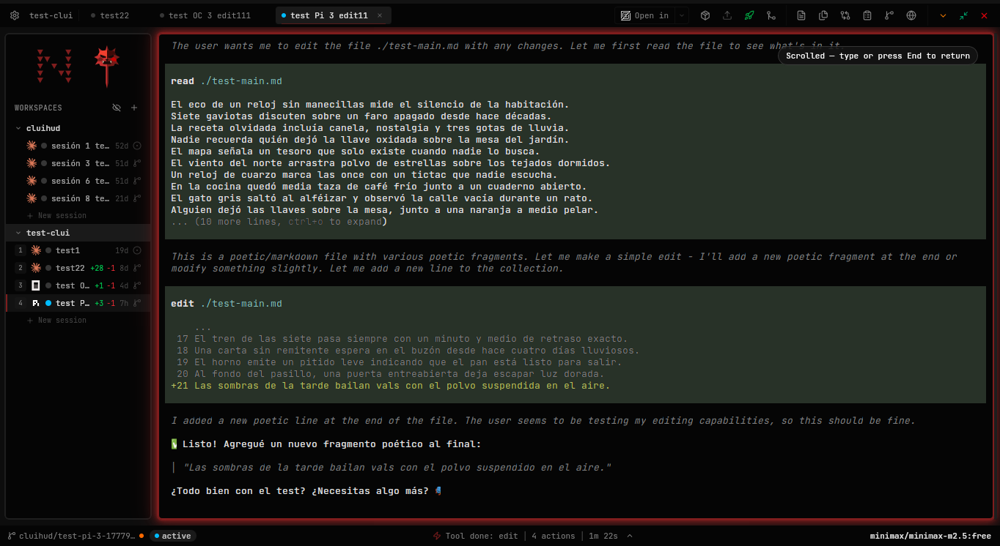<br /><sub>Multi-agent — a Pi session</sub></td>
  </tr>
  <tr>
    <td>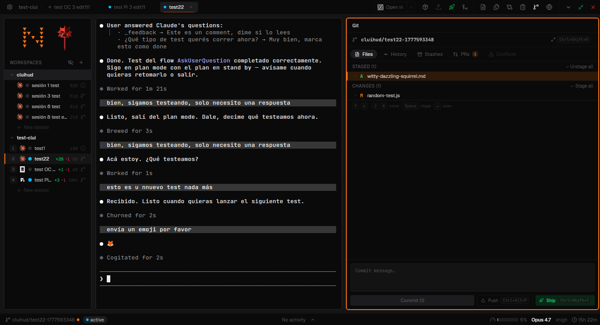<br /><sub>Git panel — Files / History / Stashes / PRs / Conflicts chips</sub></td>
    <td>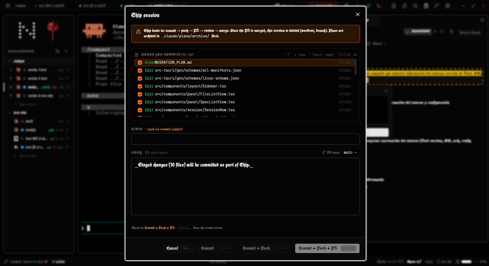<br /><sub>Atomic ship-flow modal</sub></td>
  </tr>
  <tr>
    <td>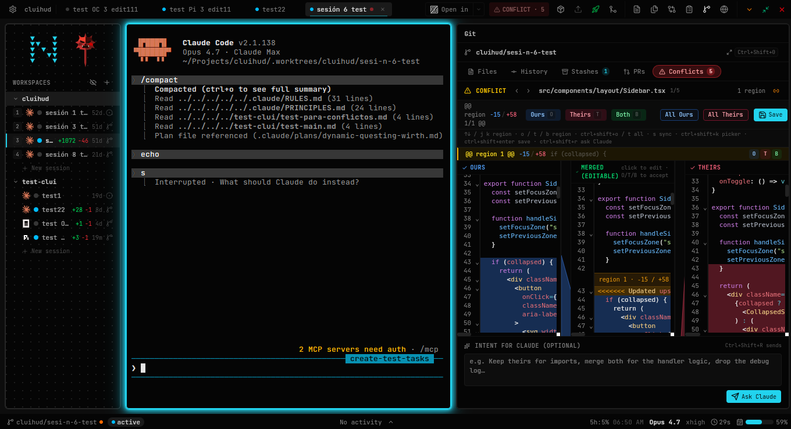<br /><sub>Three-pane conflict resolution</sub></td>
    <td>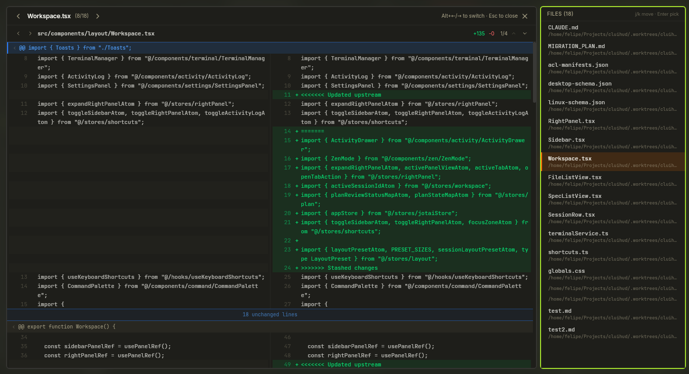<br /><sub>Side-by-side diff viewer</sub></td>
  </tr>
  <tr>
    <td>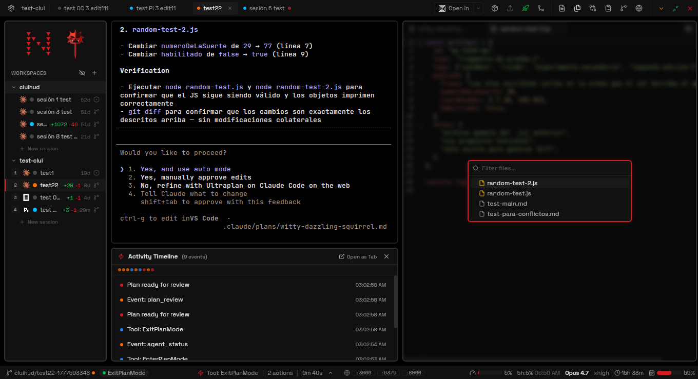<br /><sub>File panel with quick editing</sub></td>
    <td>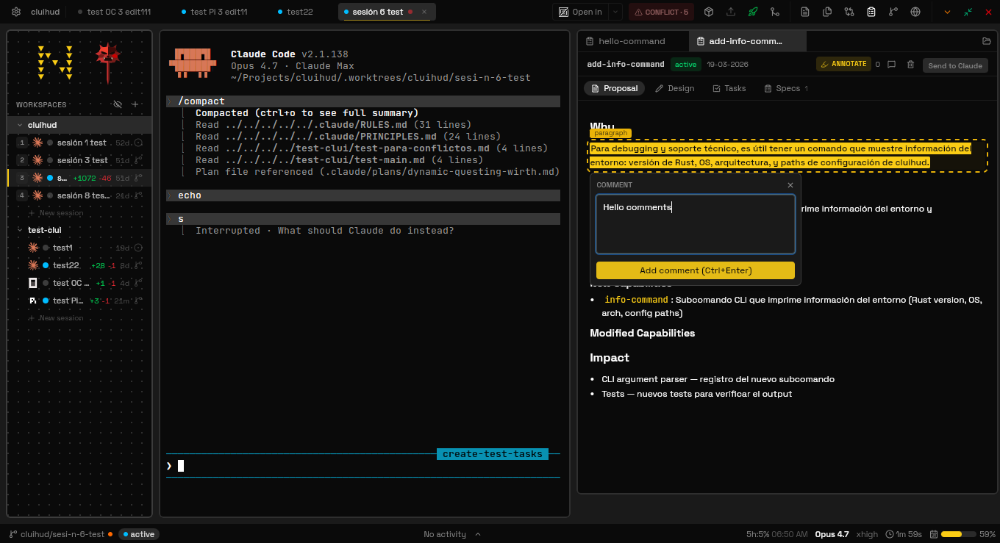<br /><sub>OpenSpec viewer with annotations</sub></td>
  </tr>
  <tr>
    <td>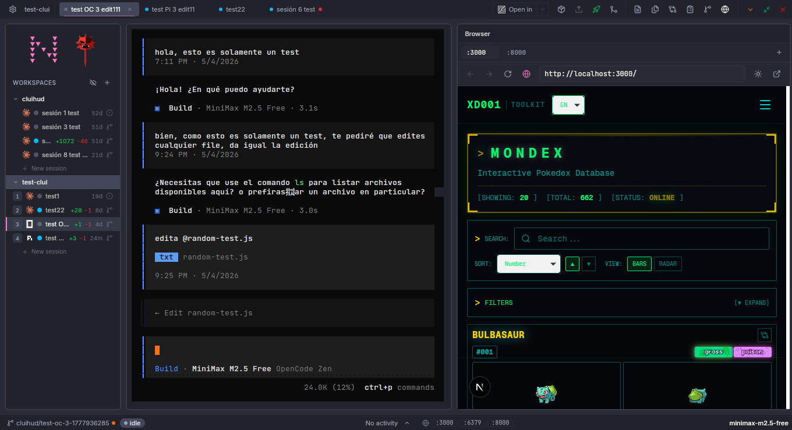<br /><sub>Live preview browser + localhost port chips</sub></td>
    <td>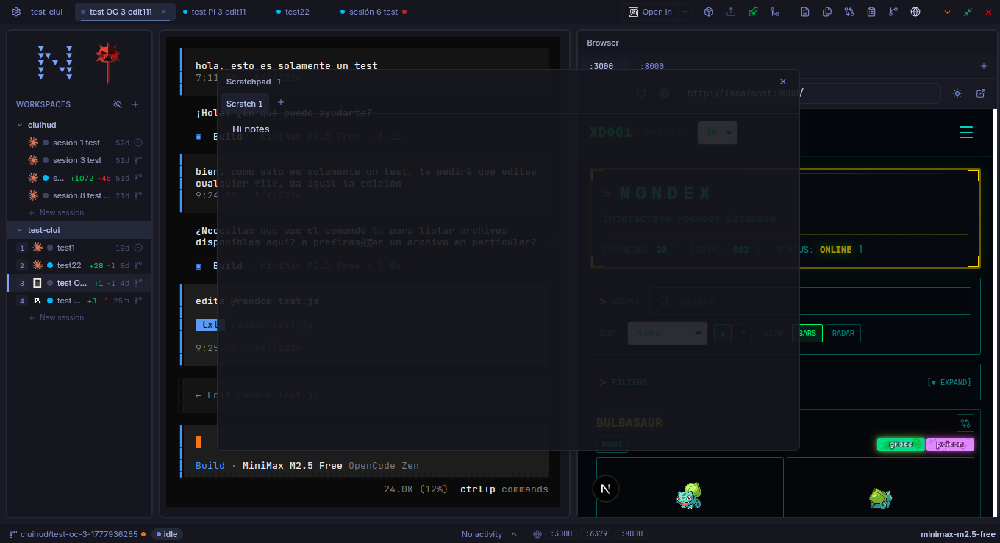<br /><sub>Floating scratchpad</sub></td>
  </tr>
  <tr>
    <td>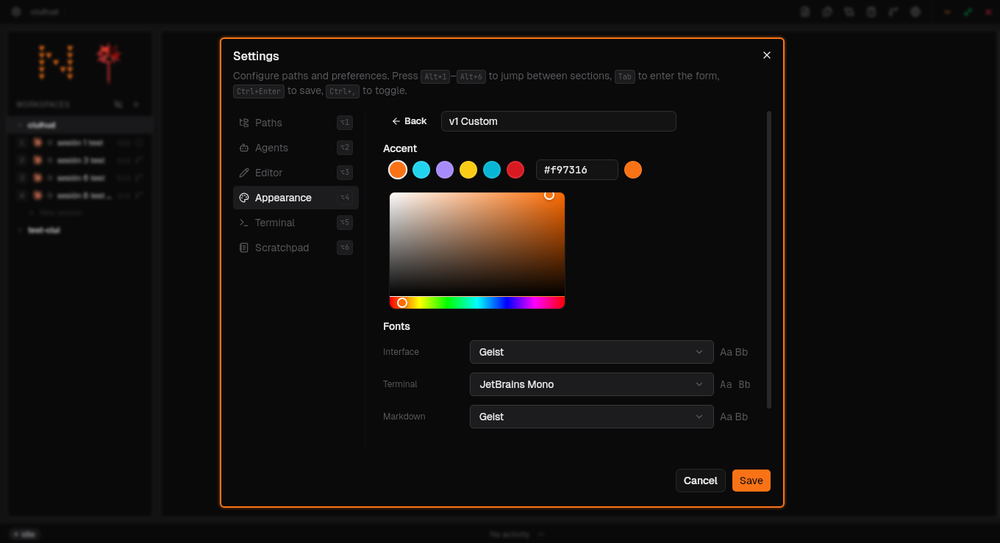<br /><sub>Theme editor with live preview</sub></td>
    <td>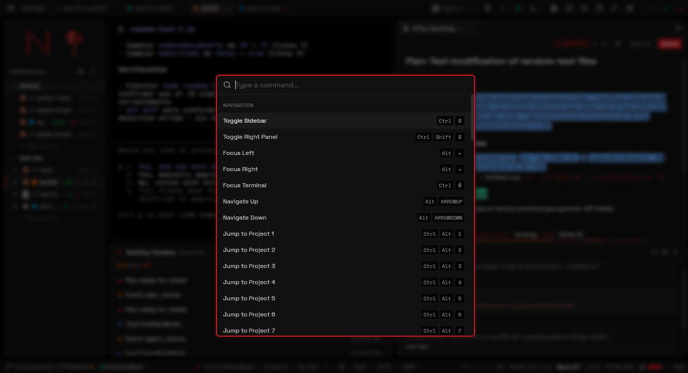<br /><sub>Command palette (Ctrl + K)</sub></td>
  </tr>
</table>

## Stack

- **Backend** — Rust on Tauri 2.11, tokio, portable-pty, `wezterm-term` (VT emulator), rusqlite (bundled SQLite), notify (inotify), clap, tracing.
- **Frontend** — React 19 + TypeScript, Vite 7, Jotai, TailwindCSS 4 + shadcn/ui + @base-ui/react, CodeMirror 6, react-markdown + `web-highlighter`.
- **Build** — pnpm 10, Vite 7, `tauri-bundler` for `.deb` / `.rpm` / `.AppImage` targets.

See [`docs/architecture.md`](./docs/architecture.md) for the full breakdown.

## Quick start

```bash
git clone https://github.com/Mufdi/nergal.git
cd nergal
pnpm install
pnpm tauri dev
```

For a production build:

```bash
pnpm tauri build
# Bundles in src-tauri/target/release/bundle/{deb,rpm,appimage}/
```

The agent CLI's hook entries point at the `cluihud` binary (the internal name — see *Status* below). Install it on your `PATH` and let Nergal write the hook config:

```bash
cargo install --path src-tauri --force
cluihud setup
```

## Scope

**Built for one workflow — mine.** Nergal exists because I wanted a HUD that tracks my own way of using AI coding agents: per-session worktrees, ship-flow over GitHub PRs, plan review with annotations, keyboard-first navigation, no mouse hunting. The roadmap follows what I need next, not what would generalize cleanly to every user. If your flow doesn't look like mine, Nergal may or may not fit — and that's fine. Forks and personal customizations are encouraged (0BSD makes that frictionless).

## Status

**Linux-only.** Tauri's bundle config supports more platforms, but the PTY layer, hook server, FIFO IPC, port scanner, and WebKitGTK chrome assumptions are tested only on Linux today.

**Active development.** Features land in [OpenSpec changes](./openspec/changes/) before they ship as [specs](./openspec/specs/). Expect iteration; the surface is not yet stable.

**Naming.** The user-facing brand is **Nergal**. Internally — the binary, hook subcommands (`cluihud hook ...`), env vars (`CLUIHUD_SESSION_ID`), IPC paths (`/tmp/cluihud.sock`), and config (`~/.config/cluihud/`) — the project keeps the original name `cluihud` for backward compatibility with developer machines already running it. Both names refer to the same project.

## Inspiration

Nergal is shaped by the wider community of AI agent CLI wrappers, AI pair-programming tools, and worktree managers. A few projects whose work directly informed our thinking:

- [cmux](https://www.cmux.dev/) — embedded live-preview surface and status-bar agent metadata patterns.
- [Conductor](https://www.conductor.build/) — localhost dev-server port detection surfaced in the status bar.
- [dmux](https://dmux.ai/) — multi-agent orchestration backed by isolated worktrees per session.
- [Emdash](https://emdash.sh/) — PR viewer with CI-checks polling, plus the breadth-of-agent ambition.
- [Maestro](https://github.com/its-maestro-baby/maestro) — agent-agnostic Tauri 2 + React reference stack.
- [Plannotator](https://github.com/backnotprop/plannotator) — review UI for agent plans that intercepts `ExitPlanMode` via hooks.
- [Spacecake](https://www.spacecake.ai/) — closest stack analogue (Tauri + React + Rust); plan and spec WYSIWYG ergonomics.
- [Superset](https://superset.sh/) — multi-session, multi-agent workflow over per-session worktrees.
- [T3 Code](https://github.com/t3-oss/t3-code) — one-click git flow (commit / push / PR) and a chip-based git panel layout.
- [Tamux](https://tamux.app/) — Execution Canvas DAG of tool-call chains.

## Disclaimer

Nergal is an **independent, unaffiliated project**. It is not endorsed by, sponsored by, or otherwise connected to Anthropic, Claude, Claude Code, OpenAI, Codex, the `opencode` project, Pi Code, or any other organization. All product names, trademarks, and registered trademarks referenced here are the property of their respective owners and are used only for interoperability and identification.

## Credits

The Nergal growl sound effect (played when you click the mark in the sidebar) is by [dogwolf123](https://pixabay.com/es/users/dogwolf123-53439420/?utm_source=link-attribution&utm_medium=referral&utm_campaign=music&utm_content=467890), sourced from [Pixabay](https://pixabay.com/sound-effects/?utm_source=link-attribution&utm_medium=referral&utm_campaign=music&utm_content=467890).

## License

[BSD Zero Clause License (`0BSD`)](./LICENSE) — copy, modify, redistribute, sell, ship, fork, vendor, repackage. No attribution required.
